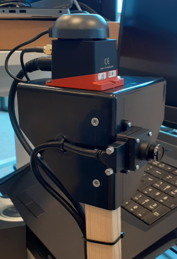

# bonsai_ws


## Getting started

Clone ROS workspace from this repository. Init submodules and install dependenties.
```
git submodule update --init --recursive

```


## Building

  - Install Basler/ROS dependencies:
```
sudo sh -c 'echo "yaml https://raw.githubusercontent.com/basler/pylon-ros-camera/master/pylon_camera/rosdep/pylon_sdk.yaml" > /etc/ros/rosdep/sources.list.d/30-pylon_camera.list' && sudo rosdep update && sudo rosdep install --from-paths . --ignore-src --rosdistro=$ROS_DISTRO -y
```

  - Copy xsens_ros_mti_driver folder from your MT SDK directory into your catkin workspace 'src' folder.
        Make sure the permissions are set to o+rw on your files and directories.

  - Build xspublic from your catkin workspace:
```
 pushd src/xsens_ros_mti_driver/lib/xspublic && make && popd
```
  - Build driver and package:
```
  catkin_make
```
  - Source workspace:
```
  source devel/setup.bash
```

## Prepare hardware

We use Basler Dart camera and Xsense MTi680 AHRS module.



## Calibrate camera intrinsics

Dart setup with https://github.com/basler/pylon-ros-camera

ROS includes a standardised camera intrinsic calibration process through camera_calibration package (http://wiki.ros.org/camera_calibration).

Apply intrinsics to ROS node
```
rosrun pylon_camera set_device_user_id daA1280_54uc
rosrun camera_calibration cameracalibrator.py --size 8x6 --square 0.025 image:=/pylon_camera_node/image_raw camera:=/pylon_camera_node
```
with content from calibration/ost.yaml and path pylon_camera with camera_setup.diff

## Calibrate camera extrinsics
Configuring the Xsens MTi node.

Use Kalibr to adjust TF from IMU to CAM
```
rosbag record /imu/data /pylon_camera_node/image_raw
rosrun kalibr kalibr_calibrate_imu_camera --bag /data/2022-11-09-20-05-36.bag --cam /data/cam_basler_camchain.yaml --imu /data/imu_xsense.yaml --target /data/april_6x6_80x80cm.yaml
```
## Using an NTRIP client with the Xsens ROS driver
Create a GGA string for your location using this 

```
$GPGGA,082306.468,4545.908,N,02113.821,E,1,12,1.0,0.0,M,0.0,M,,*60
```


## KOS
Here we explain the coordinate conventions for using our repo.

### Camera/view space

We use the OpenGL/Blender (and original NeRF) coordinate convention
for cameras. +X is right, +Y is up, and +Z is pointing back and away
from the camera. -Z is the look-at direction. Other codebases may use
the COLMAP/OpenCV convention, where the Y and Z axes are flipped from
ours but the +X axis remains the same.

### World space

Our world space is oriented such that the up vector is +Z. The XY
plane is parallel to the ground plane. In the viewer, you’ll notice
that red, green, and blue vectors correspond to X, Y, and Z
respectively.

### ROS / odometry

#### Axis Orientation

In relation to a body the standard is:
  -  x forward
  -  y left
  -  z up

For short-range Cartesian representations of geographic locations, use the east north up [5] (ENU) convention:
  -  X east
  -  Y north
  -  Z up

#### Rotation Representation

Euler angles yaw, pitch, and roll about Z, Y, X axes respectively


## Integrate with your tools

- [ ] [NERF Studio](https://docs.nerf.studio/en/latest/index.html)

- [ ] [Instant NERF](https://github.com/NVlabs/instant-ngp)


## Test and Deploy


## License
 - LGPLV3

## Project status
 - UNDER CONSTRUCTION
